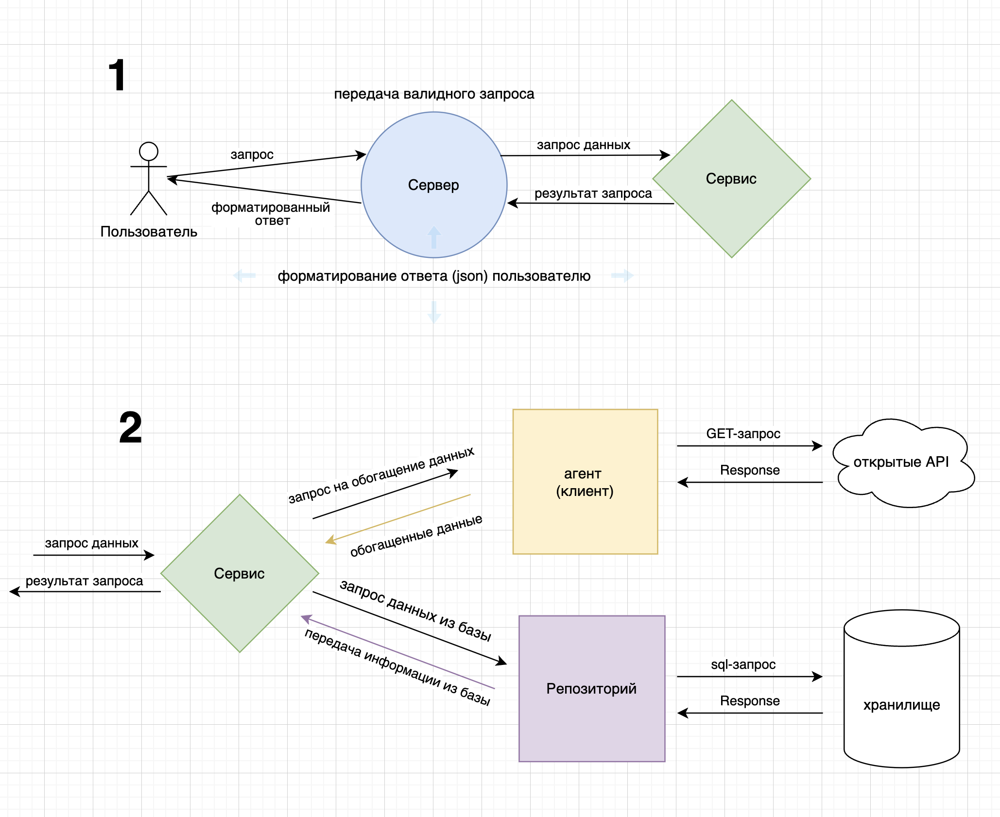
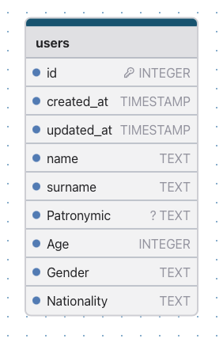

# effective-mobile-task

Проект, созданный для тестового задания на позицию Junior Golang Developer.

## Быстрый старт

_Для работы проекта необходим установленный и работающий <a href="https://docs.docker.com/get-started/">Docker</a>. Убедитесь, что он у Вас установлен._

Скопируйте репозиторий на локальную машину:
```bash
git clone https://github.com/MuhaFAH/effective-api-service.git
```

Перейдите в директорию проекта:
```bash
cd effective-api-service
```
Запустите сборку и старт приложения командой:
```bash
docker-compose up
```
Ожидайте завершения сборки и запуска приложения. В итоге Вы должны увидеть следующую log-строку:
```bash
eMobile | YYYY-MM-DD HH:MM:SS INFO EffectiveMobile: server started work on address: :8080
```
API будет доступен по следующему адресу: <b>localhost:8088</b>

Swagger будет доступен по пути: <b>localhost:8088/swagger/index.html#</b>
## Файл конфигурации .env (окружение)

Приложение по умолчанию конфигурируется с помощью default-значений

| Переменная окружения           | Значение по умолчанию | Описание                                       |
|--------------------------------|-----------------------|------------------------------------------------|
| `ADDRESS`                     | `localhost:8088`      | адрес и порт запуска сервера (вне сети докера) |
| `LOG_LEVEL`                    | `debug`               | уровень логирования                            |
| `POSTGRES_HOST`                 | `mobile-postgres`     | хост базы данных                               |
| `POSTGRES_USER`                 | `postgres`            | пользователь базы данных                       |
| `POSTGRES_PASSWORD`                 | `2006`                | пароль базы данных                             |
| `POSTGRES_DATABASE`                 | `effective-api-data`  | имя базы данных                                |
| `POSTGRES_PORT`                 | `5435`                | порт базы данных  (вне сети докера)                             |
| `POSTGRES_SSLMODE`                 | `disable`             | SSLMode базы данных                            |
| `POSTGRES_TIMEZONE`                 | `Europe/Moscow`       | часовой пояс базы данных                       |
<br>

Чтобы задать свои значения, необходимо перейти из корневой папки приложения в папку <b>configs</b>:
```bash
cd configs
```
И создать копию шаблона файла конфигурации c именем <b>local.env</b> (именно таким!)
```bash
cp env.template local.env
```
Отредактировать значения переменных окружения по своему желанию.

## Содержание

- <b>[Быстрый старт](#быстрый-старт)</b>
- [Файл конфигурации (env)](#файл-конфигурации-env-окружение)
- [Техническое задание](#техническое-задание)
- [Схемы](#схемы)
- [Функционал приложения (API)](#функционал-приложения-api)
    - [Добавление пользователя](#добавление-пользователя)
    - [Редактирование информации о пользователе](#редактирование-информации-о-пользователе)
    - [Получение информации о пользователе](#получение-информации-о-пользователе)
    - [Получение информации о пользователях (пагинация)](#получение-информации-о-пользователях)
    - [Удаление пользователя](#удаление-пользователя)
- [Использованные библиотеки](#библиотеки)
## Техническое задание

Реализовать сервис, который будет получать по API ФИО, из открытых API обогащать
ответ наиболее вероятными возрастом, полом и национальностью и сохранять данные в
БД. По запросу выдавать инфу о найденных людях.
Необходимо реализовать следующее:
1. Выставить rest методы
- Для получения данных с различными фильтрами и пагинацией
- Для удаления по идентификатору
- Для изменения сущности
- Для добавления новых людей в формате
```json
{
"name": "Dmitriy",
"surname": "Ushakov",
"patronymic": "Vasilevich" // необязательно
}
```
2. Корректное сообщение обогатить
- Возрастом - https://api.agify.io/?name=Dmitriy
- Полом - https://api.genderize.io/?name=Dmitriy
- Национальностью - https://api.nationalize.io/?name=Dmitriy
3. Обогащенное сообщение положить в БД postgres (структура БД должна быть создана
   путем миграций)
4. Покрыть код debug- и info-логами
5. Вынести конфигурационные данные в .env
6. Сгенерировать сваггер на реализованное API
## Схемы
### Схема базового построения архитектуры API

### Схема модели пользователя


## Функционал приложения (API)

### Добавление пользователя
Позволяет добавить нового пользователя. Необходимо передать имя и фамилию пользователя в тело запроса.
```
[POST] /user/create/
{
    "name":       <имяПользователя>,
    "surname":    <фамилияПользователя>,
    "patronymic": <отчествоПользователя> // необязательный параметр
}
```
Информация о пользователе обогащается системой необходимыми данными: <b>пол</b>, <b>возраст</b> и <b>национальность</b>.
### Редактирование информации о пользователе
Позволяет редактировать информацию о существующем пользователе через id. Необходимо в пути запроса указать id и передать новые данные в тело запроса.
```
[PATCH] /user/update/<ID>
{
    "name":        <имяПользователя>,       // необязательный параметр
    "surname":     <фамилияПользователя>,   // необязательный параметр
    "patronymic":  <отчествоПользователя>   // необязательный параметр
    "age":         <возрастПользователя>,   // необязательный параметр
    "gender":      <полПользователя>,       // необязательный параметр
    "nationality": <нацПользователя>        // необязательный параметр
}
```
### Получение информации о пользователе
Позволяет получить информацию о существующем пользователе через id. Необходимо в пути запроса указать id пользователя.
```
[GET] /user/get/<ID>
```
### Получение информации о пользователях
Позволяет получить информацию о группе пользователей через фильтрацию по определенным полям. Необходимо в тело запроса передать поля, по которым будет происходить фильтрация.
<br>Доступна <b>пагинация</b>:
номер страницы (page) и количество на странице (count_in_page).
```
[GET] /users/get

{
// Пагинация
"page":          <номерСтраницы>,       // необязательно, default: 1
"count_in_page": <колНаСтранице>        // необязательно, default: 10
// Фильтрация
"name":        <имяПользователя>,       // необязательный параметр
"surname":     <фамилияПользователя>,   // необязательный параметр
"patronymic":  <отчествоПользователя>   // необязательный параметр
"age":         <возрастПользователя>,   // необязательный параметр
"gender":      <полПользователя>,       // необязательный параметр
"nationality": <нацПользователя>        // необязательный параметр
}
```
### Удаление пользователя
Позволяет удалить информацию о существующем пользователе через id. Необходимо в пути запроса указать id пользователя.
```
[DELETE] /user/delete/<ID>
```
Наиболее удобная проверка через Swagger: <b><адрес>:/swagger/index.html#</b>


## Библиотеки
- HTTP: [gin-gonic/gin](https://github.com/gin-gonic/gin), [go-resty/resty](https://github.com/go-resty/resty)
- База данных (Postgres): [go-gorm/gorm](https://github.com/go-gorm/gorm)
- Логирование: [charmbracelet/log](https://github.com/charmbracelet/log)
- Переменные окружения: [ilyakaznacheev/cleanenv](https://github.com/ilyakaznacheev/cleanenv)